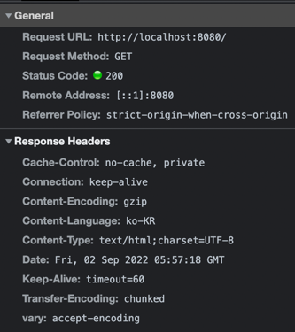

# 캐시

- [x] 0단계 - 휴리스틱 캐싱 제거하기
- [x] 1단계 - HTTP Compression 설정하기
  - [공식문서](https://docs.spring.io/spring-boot/docs/current/reference/htmlsingle/#howto.webserver.enable-response-compression)
  - 
- [x] 2단계 - ETag/If-None-Match 적용하기
  - 왜 `addUrlPatterns`에서 `"/etag/*"`로 *을 하나만 해야하는가?
    - `addPathPatterns`과의 차이점에 대해 고민해보자.
  - ```text
// 모두에서 etag가 붙음
@Bean
public ShallowEtagHeaderFilter shallowEtagHeaderFilter() { 
    return new ShallowEtagHeaderFilter();
}
```
- [x] 3단계 - 캐시 무효화(Cache Busting)
  - [x] 정적 리소스 파일의 max-age를 최대치(1년)로 설정한다.
  - [x] ETag도 적용한다.
  - [x] JS, CSS 리소스에 변경사항이 생기면 캐시가 제거되도록 url에 버전을 적용하자.
  - `cachePublic`와 `cachePrivate`은 무엇인가?
